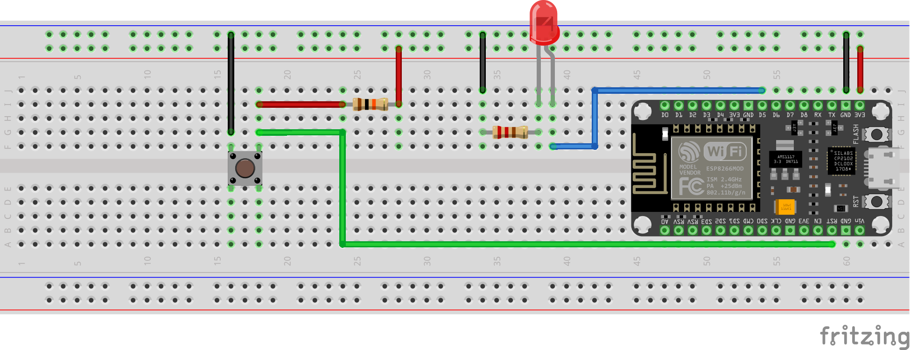

# Remote Button


## Requirements

When going to sleep, the user presses a button located next to the bed to turn off all lights in the room at once. The button sends a single command to the lighting system, ensuring every configured light is switched off within seconds. This removes the need to get out of bed or use a phone or voice assistant, making the bedtime routine faster and more reliable.

### Functinal Requirements

Functional requirements tell how device should behave.

- when pressed send event telling that something has occured - this might be further use in automation scenarios.
- compatible with [Senswave](https://www.senswave.net/) app
- using secure communication
- time of executing operations does not matter it can take up to 30 seconds
- should have external indicator that device worked correctly
- device should be heap

### Technical Requirements

Technical reqirements describe how device is build and how executes functional requirements.

- device must be battery powered
- using esp8266-based board
- configurable through .json file
- induced from functinal requirements - using mqtt as communication

### Main Program flow

This flow describes successfull execution of device task.

- read configuration
- connect to wifi
- setup security
- connect to mqtt
- send event
- sleep

## Development

Describes how device was developed and what decisions were made.

Development time of V1: 30 h.

### Problems encoutered and decisions made

__Security of the connection__
Esp8266 has no [PKI infrastructure](https://en.wikipedia.org/wiki/Public_key_infrastructure) so in order to work properly with secured connection we have to implement it manually. Possible options were to:

- accept all certificates (option available in `appsettings.json`)
- configure `Thumberint` of the certificate - need to be updated with each certificate change
- configuring CA Authority - larger space requirements (option available in `appsettings.json`)

__Debugging production device__
When module is in full casing we should allowe some debugging capabilites in order to check what problems are occuring.
This can be easily solved by introducing optional LED indication:

- success - one blink
- error - two blinks

__Production device configuration__
With time passing some configuration might change so we would like easily reconfigure device.
This is the reason for introducing configuration in json, not embeded into code.
Also this allows to extend configuration feature by introducing optional web-server that will allow to reconfigure device.

__Distinguising power-up from reset button press__
Esp8266 does not have built in GPIO-wake mechanism so only way to wake up device from deep sleep is by reseting the device.
It is easy to implement but this forces us to distinguish when button is actually pressed from when device is powered up (first time connected).
I came up with 2 solutions:

- RTC-memory - this memory resets when power is off - so with first connect we caould create a flag that will live in this memory telling if this was just a startup or expected work.
- using `ESP.getResetReason()` fortunetly this distinguishes 2 states usefull for us `deep-sleep` wake and `powered on`

### Api

__Event - Button press__
On button press device generates one evnet on configured topic `<mqtt:baseTopic>/event`, example: `device/button/remote/1/event`.
Payload send:

```json
{
  "executionTime": <integer value>,
  "timeUtc": "ISO8601 string",
  "type": "pressed"
}
```

### Configuration

The configuration is divided into three main sections: Wi-Fi, MQTT, and SSL. Each section defines the parameters required for network connectivity and secure communication.

#### `wifi`

Defines the credentials for connecting the device to the local wireless network.

- `ssid`: Name of the Wi-Fi network the device will connect to.
- `password`: Password for the specified Wi-Fi network.

#### `mqtt`

Specifies the settings used to connect to the MQTT broker.

- `url`: Hostname or IP address of the MQTT server.
- `port`: Network port used for the MQTT connection.
- `baseTopic`: Base MQTT topic under which the device publishes messages.
- `username`: Username for MQTT authentication.
- `password`: Password for MQTT authentication.
- `clientId`: Unique identifier used by the device when connecting to the MQTT broker.

#### `ssl`

Controls TLS/SSL options for securing the MQTT connection.

- `enabled`: Enables or disables SSL/TLS for MQTT communication.
- `caCertFilename`: Filename of the CA certificate used to validate the MQTT server.

### Assembly

Required parts:

- esp12-s (other esp8266 boards might work) ~ 1$
- pushbutton ~ 0.15 $
- 2x 1.5V battery (~2$ per year) or 1.2V nimh rechargeable battery (~8$ once but needs to recharge)
- 3d printed casing [Example Case](https://www.thingiverse.com/thing:7256279) ~ 3$
- 10k resistor ~ 0.01$
- few wires ~ 0$
- metal parts for bateries ~ 0$

__Note:__ Also you need something to upload code into board you can do i with programartor / usb to serial device or with own wiring.

Optional Parts:

- JST connectors or similar
- LED Diode
- 220 ohm resistor
- 2 x 10k ohm resistors

#### Assembly steps

1. Study wiring schema.
2. Connect 10K ohm resistor / wire between VCC and EN pins on board.
3. Connect VCC pin to battery + with wire (few centimeters).
4. Connect GND pin to battery - with wire (few centimeters)
5. Connect GPIO15 pin to GND pin.
6. Connect GND pin and one side of push button with wire (few centimeters).
7. Connect RST pin and second side of push button with wire (few centimeters).
8. OPTIONAL - Connect VCC pin and RSt with 10k Ohm resistor
9. OPTIONAL - Create 2 pin JST connector with short wires
10. OPTIONAL - Connect one wire of connector to GND and second to GPIO14.
11. OPTIONAL - Connect LED with second part of JST connector - REMEMBER to properly solder diode

__Note:__ LED is intended to be used as a debug information.

Wiring example:


Optional Steps


You can see how this button looks in my case on [Thingiverse](https://www.thingiverse.com/thing:7256279) where you will find example casing for button.

#### Power calcuations

- Assuming 4 clicks a day
- Assuming maximal power consumtions __300 mAh__ when working 10 seoncds after click
- Power used when in deep sleep __20 µA__
- Rechargable batteries 1.2V __750 mAh__ - so effective storage is __450 mAh__

One click usage should be around `300 * 10 / 3600 = 0.83 mAh`
One day uage is `0.83 * 4 + 0.0002 * 86360 / 3600 = 3.34 mAh`
Working for: `450 / 3.34` ~ 135 days

For 1.5V with capacity 1500 button will work for around a year.

Also i conducted some test with multimeter:

- in deep sleep mode current was around __50 µA__
- when invoking main job of the button current was __70 mA__
- in my case on average button does it work in 7.5 second not 10 seconds
- installing optional LED increases deep sleep current to __200 µA__
- second measured value is more important so actual time working on batteries can be 4 times bigger (4 years on AAA 1.5V sound beautifull)

#### Uploading code and configuration

Easiest way is to configure [Arduiono IDE](https://www.arduino.cc/en/software/) to compile and upload program to the board.
That's what I assume you will do.

- open `examples/filesystem.ino`
- update properties in `appsettings.json`
- copy `appsettings.json` from `src/devices/remote_button` and update `filename` inside example file
- compile and run program on board - this will create file `appsettings.json` inside the microcontroller
  - if using `ssl` repete previous steps, but change `filename` and paste content of your CA certificate (`-----BEGIN CERTIFICATE----- MIIFazCCA... -----END CERTIFICATE-----`)
- how you can open `src/devices/remote_button/remote_button.ino` and upload it inside the board

After uploading all necesary files best is to test this solution on beradbord, if everything works you can move to creating final device. Simplified schematic:



__Note:__ Node mcu boards are good for development so when building final device remember to use pure boards this allows us to save space and reduce costs.

## Possible Enhancments

- [allowing Over the air update](https://randomnerdtutorials.com/esp8266-nodemcu-ota-over-the-air-arduino/)
- web server for simple configuration update
- place for diode in case
- using transistor for LED - using LED increases battery drain
